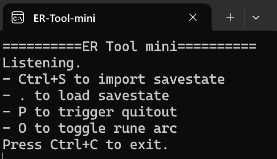

# ER Tool Mini

A minimal Elden Ring Practice Tool written in Python.



Will only work on Windows.

## How to run using binary

1. Start Elden Ring
2. Run `ER-Tool-mini.exe`

## Run using Python

```
python main.py
```

If you run into issues:

```
> venv venv
> venv\Scripts\activate
> pip install -r requirements.txt`
> python main.py
```
